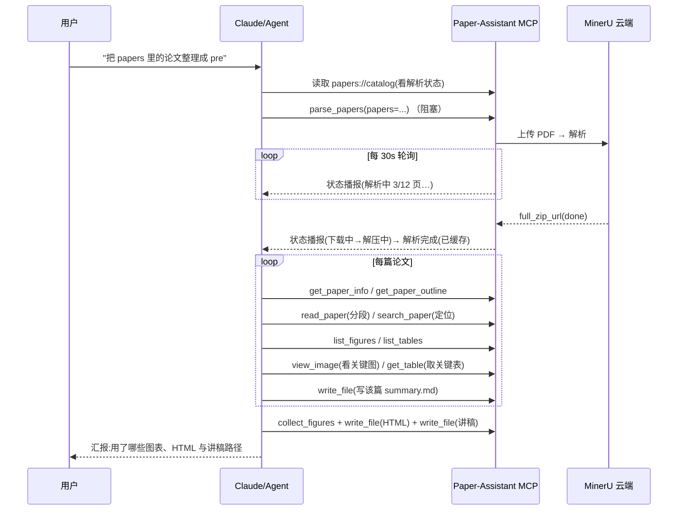

# Paper-Assistant MCP（论文阅读助手 · MinerU 版）

一个基于 [FastMCP](https://github.com/modelcontextprotocol) 的 MCP Server：**PDF 解析全部交给 [MinerU](https://mineru.net) 云端端到端完成**（文 / 图 / 表 / 公式），Server 只负责三件事——

1. **编排解析**：把 `./papers` 下的 PDF 提交给 MinerU，管好异步任务、状态播报与本地缓存；
2. **结构化检索**：在解析结果之上，让模型省 token 地按章节/页读正文、看图、取表、检索；
3. **产出汇报**：把理解结果写成带图的 pre HTML + 逐页讲稿。

覆盖并扩展了旧版能力（批量读文/图 → 理解 → 出 pre），并**新增了表格、公式与「真实看图」**三项旧版没有的能力。

---

## 相比旧版（PyMuPDF 手工解析）的变化

| 维度 | 旧版（fitz 自研） | 新版（MinerU 端到端） |
| --- | --- | --- |
| 正文 | 竖排水印/页眉页脚启发式清洗 | MinerU 直接产出干净 markdown（噪声进 discarded） |
| 大纲 | 无书签时按字号猜（易乱序） | 用 MinerU 的标题层级，**准确且保持阅读顺序** |
| 图 | 自己聚类切片 + 渲染（可能漏矢量图） | MinerU 已裁好图 + 图注，还能把图**回传给模型看** |
| 表格 | ❌ 无 | ✅ HTML → markdown |
| 公式 | ❌ 无 | ✅ LaTeX |
| 解析等待 | —（本地同步解析） | 阻塞式**每 30s 轮询 + 状态播报**（解析中/下载中/解压中） |
| 依赖 | `pymupdf` | 无需 pymupdf；仅 `mcp` + `httpx` |

---

## 环境与依赖

- Python ≥ 3.10
- 依赖：`mcp`（FastMCP）、`httpx`（HTTP 客户端，通常随 `mcp` 一并安装）

```bash
pip install -r requirements.txt   # mcp + httpx
```

### 环境变量

| 变量 | 必填 | 说明 |
| --- | --- | --- |
| `MINERU_API_TOKEN` | ✅ | MinerU 云端 API Token（在 <https://mineru.net> 申请） |
| `CLAUDE_PROJECT_DIR` | | 项目根（`papers/`、`.cache/`、输出目录的根），默认当前工作目录 |
| `MINERU_API_BASE` | | 默认 `https://mineru.net/api/v4` |
| `MINERU_MODEL_VERSION` | | 解析模型，默认 `vlm`（亦可 `pipeline`） |
| `MINERU_POLL_INTERVAL` | | 阻塞等待的轮询周期，默认 `30`（秒） |
| `MINERU_MAX_WAIT` | | `parse_papers` 的总超时，默认 `1800`（秒，≈30 分钟） |
| `MINERU_HTTP_TIMEOUT` | | 单次 HTTP 超时，默认 `180`（秒） |

> ⚠️ 隐私提示：云端模式会把 PDF 上传到 mineru.net 解析。解析结果下载到本地 `.cache/mineru/` 后即可离线检索。

---

## 安装与运行

> 前提:装有 [uv](https://docs.astral.sh/uv/)(推荐,会自动准备 Python 与依赖);或 Python 3.10+ 且 `pip install mcp httpx`。

### 方式一:npx(推荐,免安装)

```bash
# 准备论文
mkdir -p papers && cp /path/to/*.pdf papers/

# 直接运行(stdio,通常由 MCP 客户端拉起)
MINERU_API_TOKEN=xxxx npx paper-mcp
```

### 方式二:从源码运行

```bash
pip install -r requirements.txt
MINERU_API_TOKEN=xxxx python paper-mcp.py
```

### 在 MCP 客户端中注册

**用 npx(推荐):**

```json
{
  "mcpServers": {
    "paper-reader": {
      "command": "npx",
      "args": ["-y", "paper-mcp"],
      "env": {
        "CLAUDE_PROJECT_DIR": "Your-Work-Space",
        "MINERU_API_TOKEN": "your-mineru-token"
      }
    }
  }
}
```

**或直接用 Python:**

```json
{
  "mcpServers": {
    "paper-reader": {
      "command": "python",
      "args": ["paper-mcp.py"],
      "env": {
        "CLAUDE_PROJECT_DIR": "Your-Work-Space",
        "MINERU_API_TOKEN": "your-mineru-token"
      }
    }
  }
}
```

> ℹ️ npx 版本本质是一个包装器:它把打包进 npm 的 Python 源码用 `uv run --with mcp --with httpx python paper-mcp.py` 拉起。**首次运行**若 uv 需下载 Python/依赖会稍慢,之后走缓存;若客户端有 MCP 启动超时,首次可先手动 `npx paper-mcp` 预热一次。可用 `PAPER_MCP_PYTHON` 指定 Python 版本、`PAPER_MCP_NO_UV=1` 强制走系统 python。

---

## 项目结构（分层）

```
paper-mcp/
├─ paper-mcp.py            # 瘦入口：from paper_mcp.server import mcp; mcp.run()
├─ requirements.txt
└─ paper_mcp/
   ├─ config.py            # 配置、路径解析(resolve_pdf)、输出沙箱(safe_output_path)
   ├─ mineru.py            # MinerU 云端 API 客户端(纯 HTTP)
   ├─ cache.py             # 本地缓存 + manifest(按文件哈希幂等)
   ├─ content.py           # 检索/阅读层:Paper 类(大纲/正文/图/表/检索)
   ├─ parsing.py           # 解析编排:parse(阻塞,轮询+进度播报+续等)
   ├─ output.py            # 产出层:write_file / collect_figures(均沙箱)
   └─ server.py            # FastMCP 实例与工具/资源/提示注册
```

**数据流**：`parse_papers`（阻塞解析）→ MinerU 云端（上传→解析）→ 下载解压进 `.cache/mineru/<论文>/` → 检索工具读 `content_list.json`/`full.md`/`images/` → 产出 HTML/讲稿。

---

## 能力清单

### 🔧 Tools

**A. 解析编排（单个阻塞工具）**

| 工具 | 说明 |
| --- | --- |
| `parse_papers(papers="all", model_version=None, enable_formula=True, enable_table=True, language=None, ocr=False, force=False, max_wait=None, poll_interval=None)` | **阻塞式解析**：提交后每 30s 轮询一次，直到全部完成或超时（默认 1800s）；等待期间**播报进度**（见下）。已解析的按文件哈希命中缓存跳过；上次未完成的**续等原批次、不重复上传**（超时后再调一次即可继续等） |

> `parse_papers` 是异步工具：阻塞轮询在工作线程执行，不卡事件循环。等待期间按阶段用**预置多条文案随机播报**——
> 「解析中」`MinerU 正在加速解析中…（3/12 页）` → 「下载」`解析完成！正在下载解析后的文档…` → 「解压」`解析完成的文档解压中…`。
> 其中**周期性「解析中」走 MCP 进度条** `ctx.report_progress()`（`notifications/progress`，按已解析页数平滑推进 0→100%）。
> 下载/解压等瞬时子步骤只带文案，但会**复用上次进度值补发一次 `report_progress`（keep-alive）**——因为 MCP 里只有进度通知能重置客户端的空闲超时，日志通知不能，这样保证每次播报都刷新计时器。所有播报都同时写 `stderr`，**均不写 stdout**（那是 JSON-RPC 协议通道）。

**B. 检索 / 阅读**（均需先解析）

| 工具 | 说明 |
| --- | --- |
| `get_paper_info(paper)` | 标题、页数、图/表/公式数量、缓存目录 |
| `get_paper_outline(paper)` | 章节大纲（来自 MinerU 标题层级，含页码，保持阅读顺序） |
| `read_paper(paper, section=None, page_start=None, page_end=None, max_chars=8000)` | 分段读正文。图/表在正文里以 `[图 Fk]`/`[表 Tk]` 占位 |
| `search_paper(paper, query, regex=False, max_hits=20)` | 检索关键词/正则，返回片段 + 页/章节 |
| `list_figures(paper)` | 列全部图：`id`(F1…)、页、caption、footnote、path、大小 |
| `get_figure(paper, figure_id)` | 取某图的 path + 图注（**不直接返回图片**；看图请用 `view_image`） |
| `view_image(image_path)` | **读取并返回图片内容**供模型直接「看图」。仅允许读缓存/项目目录内文件 |
| `list_tables(paper)` / `get_table(paper, table_id, format="markdown")` | 列表格 / 取某表（markdown 或 html） |

**C. 产出**

| 工具 | 说明 |
| --- | --- |
| `write_file(output_path, content)` | 写文件（UTF-8，自动建父目录）。**限制在项目目录内** |
| `collect_figures(paper, figure_ids, dest_dir)` | 把选中图拷进 pre 目录，返回可用于 `` 的相对引用路径 |

### 📚 Resources

| URI | 说明 |
| --- | --- |
| `papers://catalog` | 列出 `./papers` 及**解析状态**（已解析/解析中/未解析，含页数与图表数） |
| `papers://{name}/markdown` | 某篇已解析论文的完整 markdown（MinerU `full.md`） |

### 💬 Prompts

| Prompt | 说明 |
| --- | --- |
| `papers_to_pre(papers="all", audience, language, output_path, script_path)` | 驱动 Claude：解析 → 逐篇理解（读正文/看关键图/取表）→ 每篇总结 → 汇总带图 HTML + 逐页讲稿（**HTML 与讲稿分别落盘**） |

---

## 典型工作流



---

## 设计要点

- **阻塞解析 + 进度条播报 + keep-alive**：MinerU 解析异步且耗时（每篇常数分钟）。`parse_papers` 提交后每 30s 轮询一次，每轮未完成就**推进一次进度条**（`ctx.report_progress()`，按已解析页数折算 0→100%）并附一条随机「解析中」文案。因为 MCP 里**只有进度通知能重置客户端的空闲超时**（日志通知不能），下载/解压等瞬时子步骤也会**复用上次进度值补发一次 `report_progress`（keep-alive）**，确保整个等待期间没有任何空档会被误判为卡死。阻塞循环放在工作线程，`notify` 经 `run_coroutine_threadsafe` 把播报调度回事件循环——**绝不 print 到 stdout**（stdio MCP 的 stdout 是协议通道，写它会污染 JSON-RPC）。注意进度只能重置「空闲超时」；若客户端配了「墙钟超时」（如 `.mcp.json` 的 `timeout` / `MCP_TOOL_TIMEOUT`），那是硬上限、进度顶不住，需设得比最长解析久或对 stdio 不设。
- **缓存幂等 + 可续等**：结果按**文件 sha256** 缓存，PDF 不变则永不重复烧额度；上次未完成的论文（在途批次）再次调用 `parse_papers` 会**续等原批次而非重新上传**，所以超时后直接再调一次即可继续等，不会重复解析。
- **两段式图表理解**：先 `list_figures`/`get_figure` 拿清单和图注（便宜），模型判断哪些关键，再对关键图调 `view_image` 真正看图（按需付 token）。表格同理经 `get_table`。
- **token 友好**：`read_paper` 按章节/页范围分段读并有 `max_chars` 上限；图/表在正文中以占位符出现，不 inline 大块内容。
- **写操作沙箱**：`write_file` / `collect_figures` 一律夹在 `CLAUDE_PROJECT_DIR` 内，拒绝越界写；`view_image` 只读缓存/项目目录内的图片。

---

## 常见问题

**Q：提示未配置 `MINERU_API_TOKEN`？**
A：在 <https://mineru.net> 申请 Token，并在 MCP 客户端的 `env` 里设置。

**Q：`parse_papers` 一直在播报「解析中」？**
A：长论文解析需数分钟，播报会附 `已解析/总页数`；若超过 `max_wait`（默认 1800s）会带 `timeout` 返回——此时**再调一次 `parse_papers` 即可续等同一批次**（已完成的命中缓存、在途的不重复上传），或先调大 `max_wait`。

**Q：等待期间看不到状态消息？**
A：状态走 MCP 进度条 / 日志通知与 stderr——是否**内联显示**取决于客户端对 `notifications/progress`、`notifications/message` 的渲染；`stderr` 一定会进 MCP 服务器日志。

**Q：检索工具报「尚未解析完成」？**
A：先调用 `parse_papers` 解析（阻塞，返回即代表完成）后再检索（结果读本地缓存）。

**Q：想强制重新解析？**
A：`parse_papers(paper, force=True)`（例如换了更好的 `model_version`，或 PDF 有更新）。
